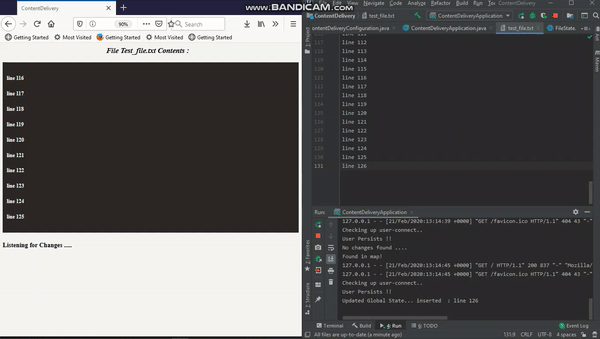

# content-delivery

How to start the content-delivery application
---

1. Run `mvn clean install` to build your application
1. Start application with `java -jar target/content-delivery-1.0-SNAPSHOT.jar server config.yml`
1. To check that your application is running enter url `http://localhost:8080`

Description
---
The application listens to additions of a file and publishes last ten lines to new webpages and adds additional lines to existing pages.
The filename mush be specified in config.yml.

See it here in Action
---

